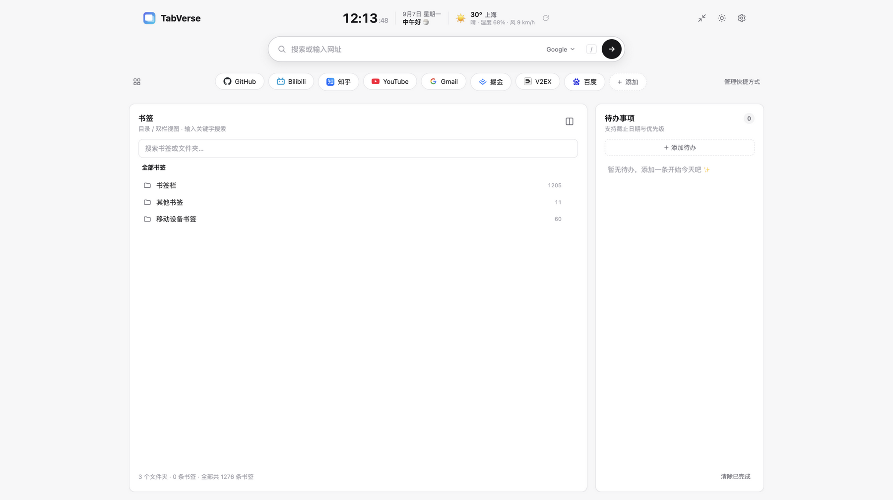
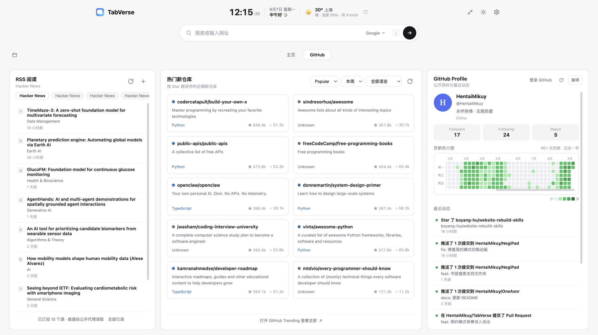

# TabVerse

Chrome 新标签页信息聚合仪表盘

一个让 Chrome 新标签页更好用、信息更聚合的浏览器扩展。

默认的新标签页只有一个搜索框和背景图，TabVerse 把它变成一个简约风格的信息聚合仪表盘（卡片式布局，设计语言参考 [XTab](https://github.com/pkc918/XTab)）：

| 功能 | 说明 |
|------|------|
| 🔍 聚合搜索 | Google / Bing / 百度 / DuckDuckGo / GitHub 引擎下拉切换；输入网址直接打开；按 `/` 快速聚焦 |
| 🔗 快捷方式 | 胶囊式常用网站，可添加 / 删除（「管理」模式），自动抓取站点图标，失败时回退字母头像 |
| 🔖 浏览器书签 | 按文件夹逐层浏览（面包屑导航），支持全局关键字搜索并标注所在路径 |
| ✅ 待办事项 | 添加 / 完成 / 删除 / 一键清除已完成，本地保存 |
| 🌤️ 天气 | 免费开源 Open-Meteo 数据，自动 IP 定位 |
| 🗂️ 标签页框架 | 内容区按标签页组织模块，副栏一键切换「快捷方式 ⇄ 标签页」 |
| 🕐 时钟问候 | 实时时钟、日期与分时段问候 |
| ☀️ 深浅色 | 点击右上角图标切换深浅模式 |

数据仅保存在本地（`chrome.storage.sync`），无任何上报。

## 技术栈

**WXT + Vue 3 + TypeScript**

- [WXT](https://wxt.dev/)
- Vue 3 + Composition API
- TypeScript（零类型错误）

## 安装

1. 执行 `pnpm build`
2. 打开 Chrome，进入 `chrome://extensions`
3. 开启开发者模式 → 加载已解压的扩展程序 → 选择 `.output/chrome-mv3/`
4. 打开新标签页即可体验

## 路线（Roadmap）

- **v0.3**：✅ 迁移到 WXT + Vue 3 + TypeScript；书签改为面包屑浏览；引入标签页框架
- **v0.4**：RSS Reader 模块；快捷方式拖拽排序
- **v0.5**：GitHub Profile + GitHub Trending 面板
- **v1.0**：设置导出/导入，交互打磨与性能优化

## 隐私

- 不收集任何数据
- 天气、图标走公开免费接口
- 仅申请 `storage`、`bookmarks` 两个权限
